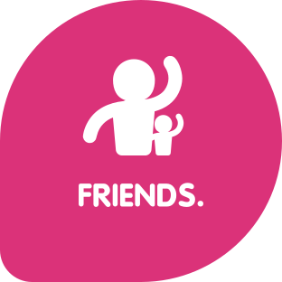

pass:[<title>Fedora Brand Guidelines</title>]

pass:[
</img>
]

Table of Contents
~~~~~~~~~~~~~~~~~
* What is Fedora?
* Logo
* Do's and Don'ts 
* Colors
* Typography
* Characters

pass:[
</img>
]

The Fedora Project is a community of people working together to build a free and open source software platform and to collaborate on and share user-focused solutions built on that platform. Or, in plain English, we make an operating system and we make it easy for you to do useful stuff with it.

The Fedora community includes thousands of individuals with different views and approaches, but together we share some common values. We call these the “Four Foundations”: Freedom, Friends, Features, and First.

pass:[
</img>
]

[%autowidth]
[frame=none]
[grid=none]
|=======================
| | *We are dedicated to free software and content.*

Advancing software and content freedom is a central community goal, which we accomplish through the software and content we promote. We choose free alternatives to proprietary code and content and limit the effects of proprietary or patent encumbered code on the Project.
|    | *We are a strong, caring community.*

The Fedora community is made up of people from all walks of life, working together to advance free software. There is a place in Fedora for anyone who wants to help, regardless of technical skill level, as long as they believe in our core values.
|    | *We care about excellent software.*

The Fedora community creates many of the technical features that have made Linux powerful, flexible, and usable for a wide spectrum of millions of users, administrators, and developers worldwide. We recognize the status quo is worth changing to empower additional end-users, or to create a more flexible and powerful environment for building new solutions on the free software we provide.
|   | *We are committed to innovation.*

We are not content to let others do all the heavy lifting on our behalf; we provide the latest in stable and robust, useful, and powerful free software in our Fedora distribution.
|=======================

pass:[
</img>
]

These logos are used for many purposes across many different designs, including software applications, web sites, T-shirts, event booth tablecloths and banners, and other printed material. 

While it may seem as if your change to the logo is minor, the impact of such changes is much more widespread than you might initially think. We seek to have a consistent and recognizable logo that is taken seriously in order to help us fulfil Fedora's mission of leading the advancement of free and open source software and content. 

Fedora Logo Basics
~~~~~~~~~~~~~~~~~~

|=======================
|image:images/fedora_default-logo.png[alt="Fedora Default Logo"] Fedora Default Logo | image:images/fedora_one-color-horizontal.png[alt="Fedora One Color Logo - Black"] Fedora One Color Logo - Black
|image:images/fedora_fedora-vertical.png[alt="Fedora Vertical Logo"] Fedora Vertical Logo | image:images/fedora_vertical-gradient.png[alt="Fedora Vertical Gradient Logo"] Fedora Vertical Gradient Logo
|image:images/fedora_one-color-vertical.png[alt="Fedora One Color Vertical Logo - Black"] Fedora One Color Vertical Logo - Black | image:images/white-vertical.png[alt="Fedora One Color Vertical Logo - White"] Fedora One Color Vertical Logo - White
|image:images/fedora_white-and-blue-f-white-text.png[alt="Fedora Vertical Logo - White and Blue Logo, White Text"] Fedora Vertical Logo - White and Blue Logo, White Text | image:images/fedora_blue-f-white-text.png[alt="Fedora Vertical Logo - Blue Logo, White Text"] Fedora Vertical Logo - Blue Logo, White Text
|=======================

Logos from different Fedora Sub-projects
~~~~~~~~~~~~~~~~~~~~~~~~~~~~~~~~~~~~~~~~

These logos come from different projects within the Fedora community. If you would like to learn more about these logos, please visit:
https://docs.fedoraproject.org/en-US/project/brand/

|=======================
|image:images/fedora_workstation.png[alt="Fedora Workstation Logo"] Fedora Workstation Logo | image:images/fedora_silverblue.png[alt="Fedora Silverblue Logo"] Fedora Silverblue Logo
|image:images/fedora_server.png[alt="Fedora Server Logo"] Fedora Server Logo | image:images/fedora_iot.png[alt="Fedora IoT Logo"] Fedora IoT Logo
|image:images/fedora_coreos.png[alt="Fedora CoreOS Logo"] Fedora CoreOS Logo | image:images/fedora_magazine.png[alt="Fedora Magazine Logo"] Fedora Magazine Logo
|image:images/fedora_remix.png[alt="Fedora Remix Logo"] Fedora Remix Logo | 
|=======================

[[cheat-sheet]]
AsciiDoc Mini Cheat Sheet
~~~~~~~~~~~~~~~~~~~~~~~~~

To help you get started, here're some snippets from the
http://powerman.name/doc/asciidoc[AsciiDoc Cheet Sheet^]. Feel free to poke
around :)

Text Styles
^^^^^^^^^^^
* normal, _italic_, *bold*, +mono+.
* ``double quoted'', `single quoted'.
* normal, ^super^, ~sub~.
* `passthru *bold*`

Tables
^^^^^^
.An example table
[options="header,footer"]
|=======================
|Col 1|Col 2      |Col 3
|1    |Item 1     |a
|2    |Item 2     |b
|3    |Item 3     |c
|6    |Three items|d
|=======================

Lists
^^^^^

* Q: How did the programmer die in the shower?
  A: He read the shampoo instructions:

  . Lather, rinse.
  . Repeat.

* There are only 10 kinds of people in this world:
  - Those who understand binary.
  - Those who don't.

Misc
^^^^

* Code listings:
+
[source,python]
-----------------
#!/usr/bin/env python
import antigravity
try:
  antigravity.fly()
except FlytimeError as e:
  # um...not sure what to do now.
  pass
-----------------

* Quotes:
+
[quote,"Charles Dickens","A Tale of Two Cities"]
It was the best of times, it was the worst of times, it was the age of wisdom,
it was the age of foolishness...

* Links:
** http://asciidoclive.com/[AsciiDocLIVE^] is awesome!

* Images:
+
image:https://i.imgur.com/AEkqoRn.jpg[alt="not bad.",width=128,height=128]

* Videos:
+
video::th_H1gixMEE[youtube]

* Pass-through: pass:[
<b>pass through content</b>
]

pass:[
</img>
]

